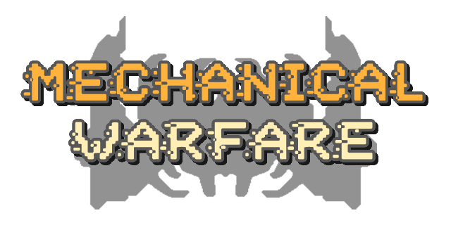

# Unit Classes

Mechanical Warfare introduces a tier system for units, which divides all units into 4 tiers (classes):
- Orange
- Cyan
- Purple (upcoming)
- Red (upcoming)

Units in each class have a certain average DPS, ranging from low (Orange) to extreme (Red). Unit factories also have a color indicator on their tops to determine their respective unit classes.
